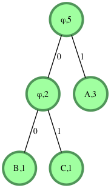

# Feladat címe: The Huffman decoding

## A feladat linkje: [Huffman decoding](https://www.hackerrank.com/challenges/tree-huffman-decoding/problem)

#### Leírás

> A Huffman kódolás változó hosszúságú kódszavakat rendel a rögzített hosszúságú bemeneti karakterekhez azok gyakorisága alapján. 
> 
> A gyakoribb karakterekhez rövidebb kódszavakat, a ritkább karakterekhez pedig hosszabb kódszavakat rendelnek hozzá. 
> 
> A karakter elérési útja mentén minden él tartalmaz egy kódszámjegyet.
> 
> Ha a fa bal oldalán vannak, akkor 0 lesz. Ha a jobb oldalon, akkor 1-es lesz.
> 
> Csak a levelek tartalmaznak egy betűt és annak gyakorisági számát. Az összes többi csomópont karakter helyett null karaktert fog tartalmazni, valamint az összes és a leszármazott karakterek gyakoriságának számát.

#### Konkrét példa

> Bevitel:
> 
> 
> 
> `s="1001011"`
> 
> Kimenet:
> 
> `ABACA`
> 
> Magyarázat:
> 
> ```
> S="1001011"
> Balról jobbra kezdjük a feladatmegoldást.
> S[0]='1' : a gyökér jobboldali gyerekéhez megyünk. Találunk egy olyan levelet, amin 'A' szerepel. Hozzáadjuk 'A'-t a dekódolt stringhez.
> Visszamegyünk a gyökérhez.
> 
> S[1]='0' : a baloldali gyerekhez megyünk. 
> S[2]='0' : a baloldali gyerekhez megyünk. Találunk egy olyan levelet, amin 'B' szerepel. Hozzáadjuk 'B'-t a dekódolt stringhez.
> Visszamegyünk a gyökérhez.
> 
> S[3] = '1' : gyökér jobboldali gyerekéhez megyünk. Találunk egy olyan levelet, amin 'A' szerepel. Hozzáadjuk 'A'-t a dekódolt stringhez.
> Visszamegyünk a gyökérhez.
> 
> S[4]='0' : a baloldali gyerekhez megyünk.
> S[5]='1' : gyökér jobboldali gyerekéhez megyünk. Találunk egy olyan levelet, amin 'C' szerepel. Hozzáadjuk 'C'-t a dekódolt stringhez.
> Visszamegyünk a gyökérhez.
> 
>  S[6] = '1' : gyökér jobboldali gyerekéhez megyünk. Találunk egy olyan levelet, amin 'A' szerepel. Hozzáadjuk 'A'-t a dekódolt stringhez.
> Visszamegyünk a gyökérhez.
> 
> Dekódolt string = "ABACA"
> ```

#### Függvény
>
> A `decode_huff` függvénynek vissza kell térnie a dekódolt stringgel.
>
> A függvény a következő paraméterekkel rendelkezik:
>
> - gyökér: egy referencia a gyökér `node`-ra A Huffman fában
> - s: egy Huffman kódolt string
>
> ##### Input
>
> - Egyetlen egy sor van, amit a standard inputról olvas be, és ez a kódolt string
> - Háttérkód csinálja meg a Huffman  fát és adja oda a referenciát a függvénynek
>
> ##### Korlátok
>
> - 1<= |s| <= 25