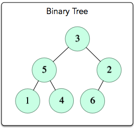

# Feladat címe: Is this a binary search tree?

## A feladat linkje: [Is this a binary search tree?](https://www.hackerrank.com/challenges/is-binary-search-tree/problem)

#### Leírás

> Ebben a feladatban a bináris fát, bináris keresőfának definiáljuk a következő feltételek mellet:
> 
> - Az `adat` értéke az egyes `node`-nak nagyobb, mint amennyi az értéke a tőle balra levő `node` `adat` értékének.
> - Az `adat` értéke az egyes `node`-nak kisebb, mint amennyi az értéke a tőle jobbra levő `node` `adat` értékének.

#### Konkrét példa

> Bevitel:
> 
> 
> 
> Kimenet: **NEM**

#### Függvény
>
> A `check_binary_search_tree_` függvénynek vissza kell térnie egy `Boolean` értékkel, hogy a bináris fa az bináris keresőfa-e. 
>
> A függvény a következő paraméterekkel rendelkezik:
>
> - Egy `pointer`, ami a bináris fa gyökerére mutat
>
> ##### Input
>
> Ehhez a feladathoz nem kell semmit sem beolvasni a standard inputról, ugyanis rejtett kód rakja össze a bináris fát és adja át a gyökerét a függvénynek.
>
> ##### Korlátok
>
> - 0 <= `adat` <= 10^4